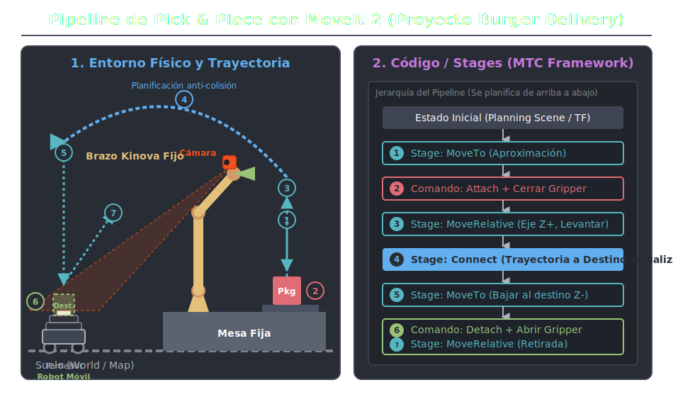

# Marco Conceptual de MoveIt 2

## ¿Qué es MoveIt 2?

**MoveIt 2** es la biblioteca estándar en el ecosistema de ROS 2 para la manipulación robótica avanzada. Se diseñó asumiendo que el desarrollador proporciona tres componentes físicos/lógicos (modelos URDF/SRDF, estado de los joints a través de topics, y una interfaz de hardware) y a cambio, MoveIt gestiona la compleja matemática detrás de moverse de un punto "A" a un punto "B" en el espacio tridimensional sin golpear nada en el camino.

MoveIt 2 abstrae la robótica debajo de APIs de alto nivel (en C++ y Python), convirtiendo tareas complejas como *Cinemática Inversa (IK), Planificación de Trayectorias y Comprobación de Colisiones* en funciones fácilmente ejecutables en sistemas empotrados o en la nube.

---

## 1. Arquitectura Central (`move_group`)

El núcleo principal de la plataforma es un nodo de ROS 2 llamado **`move_group`**. Éste funciona como un gran integrador (el "cerebro" del manipulador). 

### Entradas del `move_group`:
*   **Robot State (`/joint_states`)**: Suscrito a los encoders del hardware (vía `ros2_control`) para saber qué ángulos exactos tiene el brazo en todo momento.
*   **Transformaciones (`/tf`)**: Conoce el árbol posicional del robot para relacionar su "base" con la "punta (end-effector)".
*   **Sensores / Mundo Externo**: Recibe información en tiempo real de nubes de puntos o cámaras de profundidad para poblar entornos como obstáculos evitando trayectorias a ciegas.

### Salidas del `move_group`:
*   **Follow Joint Trajectory**: Envía puntos estructurados por tiempo (Action Goal) a los controladores de hardware robótico (`JointTrajectoryController`).

---

## 2. Conceptos Clave (El Motor)

Para que el robot vaya a un punto, MoveIt 2 utiliza varios submódulos matemáticos y computacionales:

*   **Cinemática (KDL, TRAC-IK, IKFast)**: Es el corazón matemático que responde a *"Si quiero que mi pinza esté en [x:1.0, y:0.0, z:2.0], ¿qué ángulos deben tener mis 7 motores?"*.
*   **Planning Scene (El Mundo 3D)**: Es el modelo espacial que tiene el robot del mundo. Contiene la malla anatómica del brazo, pero sobre todo **los objetos de colisión** conocidos (como paredes, las repisas, e incluso un carro debajo de él).  
*   **Planificación (OMPL)**: La *Open Motion Planning Library* evalúa cientos de miles de árboles aleatorios (RRT, PRM) en ráfagas de milisegundos intentando encontrar una trayectoria "segura" de colisiones en el *Configuration Space* (Espacio articular) que logre llevar la punta del robot hacia su pose deseada.

---

## 3. MTC (MoveIt Task Constructor)

Mientras que el núcleo de MoveIt resuelve el movimiento "Punto A a Punto B", aplicaciones logísticas como **Burger Delivery** necesitan encadenar múltiples movimientos (Ej: *"Acércate a un vaso, ábrete, acércate más, ciérrate, sube y muévelo"*).

Aquí entra el **MoveIt Task Constructor (MTC)**, una sub-arquitectura que se está convirtiendo en el estándar de ROS 2 para programar manipuladores. 

El marco conceptual de MTC abandona las llamadas manuales a `move_to_pose()` y usa **Stages (Etapas)**:
1.  **Generators**: Engendran poses de inicio (`CurrentState`) o generan búsquedas.
2.  **Propagators**: Propagan trayectorias de un punto conocido a otro (Ej. `MoveRelative` para moverse 5cm a lo largo del eje Z+ global para "Levantar").
3.  **Connectors**: Une trayectorias calculadas entre dos puntos diferentes (`MoveTo`).

MTC puede probar millones de combinaciones *hacia adelante o hacia atrás* a través del árbol de conectores y descarta el set entero de trayectorias si detecta que la caja chocará con otro objeto incluso varias etapas antes del final de ejecución.

---

## 4. Aplicación Curada para "Burger Delivery" (El rol crítico de TF2)

En nuestra arquitectura, transferir un paquete de forma autónoma depende vitalmente de conectar MoveIt 2 con el nodo de localización AprilTag a través del árbol de transformaciones (`tf2`):

1. **TF2 como el Puente Espacial**: Para que MTC sepa y planifique hacia dónde realizar el movimiento geométrico para soltar el paquete ("Place"), el nodo de localización AprilTag calcula la matriz espacial relativa respecto al AprilTag del TurtleBot usando las detecciones de cámara.
2. El `move_group` escucha permanentemente las ramas activas del tópico `/tf` (`kinova_base_link` -> `camera_link` -> `apriltag_pose_robotN`). **MoveIt usaría esa transformación exacta como su Goal final o "Destino".** ¡Sin el sistema de TF, la percepción y la manipulación estarían hablando idiomas completamente diferentes!
3. Internamente, el planificador de **OMPL** evitará chocar empleando la **Planning Scene** construida bajo tu archivo maestro `delivery_scene_fixed.urdf`.
4. Mediante las etapas lógicas de **MTC**, el Kinova ejecuta el comando *Attach* sobre el paquete (caja de delivery). Automáticamente la caja adopta una rama dinámica dentro de `/tf` anclada al gripper, lo cual instruye al planificador que la propia caja es un nuevo elemento a proteger de colisiones antes de dejarla sobre el TurtleBot.

### Diagrama Sugerido
Para referenciar visualmente este pipeline logístico dentro del alcance del proyecto, revisa el archivo de arquitectura base:

---

## 5. ¿Dónde está especificado el Árbol TF en este Proyecto?

Toda la "magia" espacial que necesita MoveIt está estructurada sistemáticamente en tus archivos fuente. Actualmente, la definición recae en la descripción estática de la escena:

1. **Definiciones Geométricas Matemáticas (URDF):** 
   El entramado espacial estricto (como la relación matemática entre el origen `map`, la mesa `table_link`, y la base del manipulador `kinova_base_link`) está anclado usando etiquetas `<joint type="fixed">` explícitas dentro de tu modelo:
   👉 `burger_description/urdf/delivery_scene_fixed.urdf`

2. **Transmisión Activa a ROS (Launch File):**
   Ese archivo XML es estático. Para convertirlo en TFs vivas y matemáticamente digeribles, tu archivo:
   👉 `burger_description/launch/display.launch.py`
   Ejecuta el paquete estándar **`robot_state_publisher`**. ¡Este nodo es literalmente quien parsea el URDF y transmite el árbol constantemente a la red bajo el tópico público `/tf_static`!

3. **Inyección Dinámica de Localización AprilTag (Pendiente de Implementar):**
   Las transformaciones que determinan dónde están rodando los TurtleBots (`apriltag_pose_robot1`, etc.) **aún no residen en el código fuente actual**. Son la siguiente capa lógica a desarrollar. Consistirá en un Nodo en C++/Python instanciando un `tf2_ros::TransformBroadcaster` que nutrirá al árbol base (el que montó el URDF) con las matemáticas captadas en tiempo vivo por la cámara Kinova.
