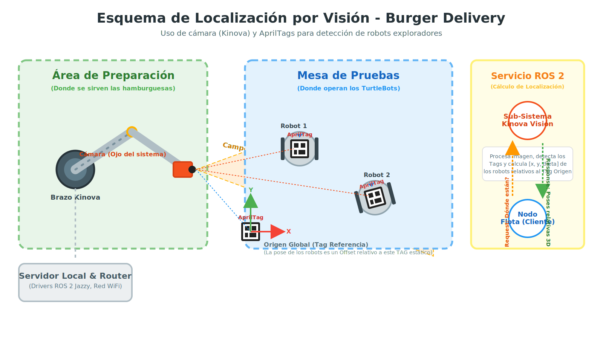
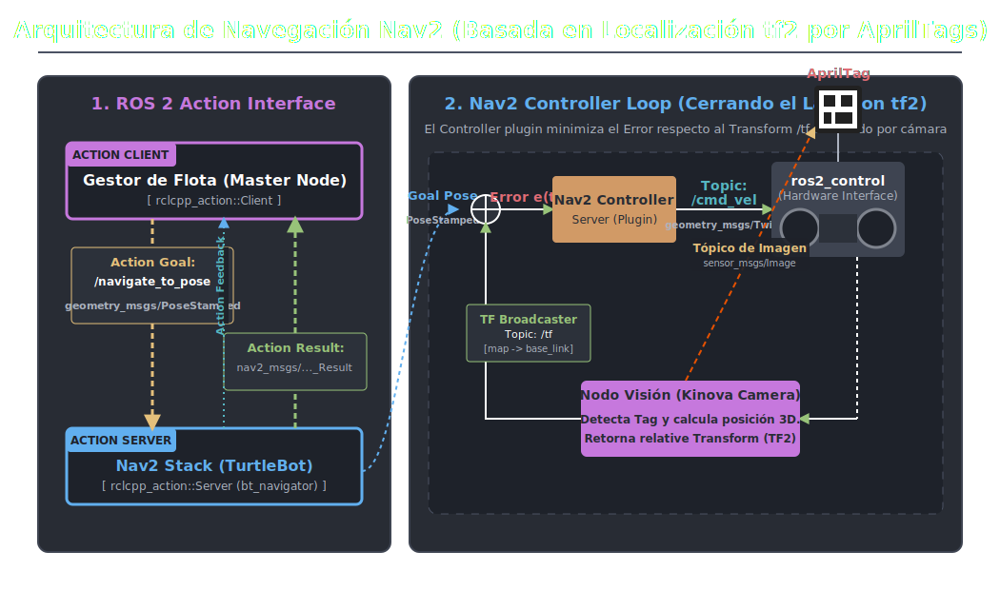
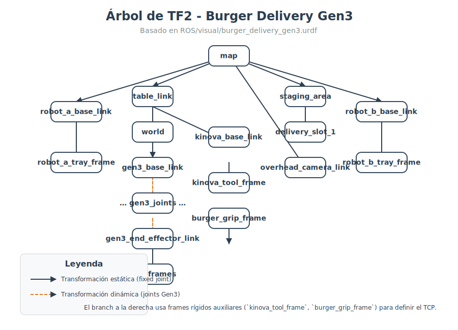

# burger_delivery

Este repositorio centraliza la documentación, los modelos y los recursos usados en el proyecto **Burger Delivery con ROS 2 Jazzy**. El foco principal es la celda donde un manipulador **Kinova Gen3** entrega bandejas a robots diferenciales coordinados mediante `tf2`, visión por AprilTags y micro-ROS, optimizado para entornos inalámbricos de alta densidad.

Actualmente, el contenido implementado en este repositorio está centrado en el paquete `burger_description`, la visualización de la escena, scripts auxiliares y documentación técnica para Linux o WSL.

## Alcance actual

Este proyecto contiene hoy:

- Un paquete ROS 2 compilable: `burger_description`.
- Modelos URDF de la escena de entrega.
- Un `launch` para publicar TF, mover joints manualmente y abrir RViz.
- Mallas vendorizadas del Kinova Gen3, de la pinza y de dos carros móviles.
- Documentación de arquitectura, instalación y red.
- Scripts auxiliares para build, lanzamiento y diagnóstico.

No contiene todavía un stack completo de operación autónoma en este repositorio: no hay paquetes propios de navegación, percepción, planeación o lógica de pedidos listos para compilar aquí.

## Estructura

- `burger_description/`: paquete ROS 2 principal.
- `burger_description/urdf/delivery_scene_fixed.urdf`: escena principal usada por el launch actual.
- `burger_description/urdf/burger_delivery_gen3.urdf`: variante adicional de escena con Gen3.
- `burger_description/launch/display.launch.py`: lanza `robot_state_publisher`, `joint_state_publisher_gui` y `rviz2`.
- `burger_description/rviz/default.rviz`: configuración base de RViz.
- `burger_description/visual/`: mallas auxiliares y modelos de los carros.
- `burger_description/vendor/`: recursos vendorizados de Kinova/Robotiq.
- `network_setup/`: scripts y guías de diagnóstico de red ROS 2 y micro-ROS.
- `ros2_setup/`: notas de instalación y verificación de ROS 2 Jazzy.
- `vision_setup/`: diagnóstico de conectividad visual, protocolos ópticos RTSP y uso de OpenCV.
- `scripts/`: herramientas vitales de parcheado de latencias del Kinova y testeos unitarios físicos CLI.
- `lanzar_robot.sh`: script rápido para abrir la visualización y `rqt`.
- `build_burger.sh`: script de compilación del paquete.

## Qué modela el URDF

La escena incluye:

- Frame raíz `map`.
- Mesa de trabajo `table_link`.
- Zona de staging `staging_area`.
- Un slot de entrega `delivery_slot_1`.
- Base auxiliar del manipulador `kinova_base_link`.
- Tool frame y grip frame (`kinova_tool_frame`, `burger_grip_frame`).
- Cámara aérea `overhead_camera_link`.
- Brazo Kinova Gen3 de 7 GDL.
- Pinza (2F Adapter).
- Frames de cámara de muñeca.
- Dos robots móviles de referencia: `car1` y `car2` (posición controlada por TF dinámico).
- Frame de referencia visual `tag_mesa` anclado a la esquina de la mesa (base del sistema de localización por AprilTags).
- Un bloque `ros2_control` para hardware Kinova con plugin `kortex2_driver/KortexMultiInterfaceHardware`.

## Requisitos

- Ubuntu con ROS 2 Jazzy instalado.
- `colcon`.
- Paquetes de escritorio de ROS 2 para usar RViz.
- Dependencias declaradas por el paquete:
  - `joint_state_publisher_gui`
  - `robot_state_publisher`
  - `rviz2`
  - `xacro`

Si necesitas instalar ROS 2 desde cero, revisa `install_ros2.sh` y la documentación en `ros2_setup/`.

## Compilación

Si este repositorio está dentro de `~/ros2_ws/src`, compila así:

```bash
cd ~/ros2_ws
source /opt/ros/jazzy/setup.bash
colcon build --packages-select burger_description
source install/setup.bash
```

También existe el script:

```bash
./build_burger.sh
```

## Ejecución

Lanzamiento manual:

```bash
cd ~/ros2_ws
source install/setup.bash
ros2 launch burger_description display.launch.py
```

Ese launch abre:

- `robot_state_publisher`
- `joint_state_publisher_gui`
- `rviz2`

Script rápido:

```bash
./lanzar_robot.sh
```

Ese script además intenta abrir `rqt`.

## Notas de uso

- El launch actual carga `burger_description/urdf/delivery_scene_fixed.urdf`.
- En RViz usa `map` como `Fixed Frame`.
- **Carritos móviles:** `delivery_scene_fixed.urdf` describe la celda fija. Los carritos se cargan desde URDFs separados (`car1_apriltag.urdf`, `car2_apriltag.urdf`) para que puedan colgar del `frame` dinámico publicado por el nodo de localización AprilTag.

  | Modo | Comando | Cuándo usarlo |
  |---|---|---|
  | **Producción** (defecto) | `ros2 launch burger_description display.launch.py` | Carga la escena y los URDFs de los carritos. Los carritos se conectan al mapa cuando el nodo de localización AprilTag publica `tag_mesa -> tag_carrito*`. |
  | **Visualización temporal** | `ros2 launch burger_description display.launch.py use_static_carts:=true` | Publica TFs temporales `tag_mesa -> tag_carrito1/2` para ver los carritos mientras no existe el nodo de localización AprilTag. |

- No publiques simultáneamente `map -> car_base_link` y `tag_carrito -> car_base_link`: cada `child frame` debe tener un solo padre en TF.

- El paquete instalable es `burger_description`, aunque el repositorio se llama `burger_delivery`.
- `lanzar_robot.sh` usa una ruta absoluta al workspace del entorno actual: `/home/roncanciovl/ros2_ws/install/setup.bash`. Si mueves el proyecto a otra máquina, tendrás que ajustarla.

## Documentación adicional

- `burger_description/GUIA_DE_USO.md`: guía rápida de uso.
- `burger_description/README.md`: README específico del paquete.
- `ros_burger_delivery.md`: documento técnico de arquitectura y flujo propuesto.
- `VISUALIZAR_URDF_WEB.md`: notas para visualizar URDF en visor web.
- `network_setup/DIAGNOSTICO_RED.md`: guía de diagnóstico de red ROS 2.
- `network_setup/ROS2_NETWORK_CONFIG.md`: configuración de red recomendada.
- `ros2_setup/INSTALACION_KORTEX.md`: instalación del stack Kortex.
- `ros2_setup/verificar_ros2.md`: verificación de instalación de ROS 2 Jazzy.
- `MEJORAS_MOVIMIENTO_KINOVA.md`: guías de escalado MTC (5%) y explicativo del visualizador fantasma Ghost en RViz.
- `PRUEBAS_MOVIMIENTO.md`: manual unitario explicando cómo inyectar coordenadas de prueba cartesianas usando terminal.
- `vision_setup/VERIFICACION_CAMARA.md`: diagnóstico de cámara nativo.
- `vision_setup/DIAGNOSTICO_RED_VISION.md`: aislamiento de latencia visual (TCP vs ROS 2 Topic).
- `vision_setup/LOCALIZACION_APRILTAG.md`: **⭐ Arquitectura del sistema de localización AprilTag.** Explica el árbol TF, el pseudo-código del nodo de localización y todas las advertencias de calibración y ajuste físico de tags.

## Diagramas de referencia

Los siguientes diagramas en formato SVG sirven como referencia rápida de arquitectura, transformaciones y localización del sistema:

### Esquema de Localización AprilTag

Esquema visual que mapea la posición del brazo respecto a la mesa de trabajo de los móviles y el marco estático de referencia de los AprilTags:



### Navegación de Movimiento (Nav2 + Localización AprilTag)

Arquitectura Cliente/Servidor de ROS 2 Action y Lazo de Control Cinemático compensado para los comandos de entrega del TurtleBot:



### Pipeline de Manipulación Pick & Place

Jerarquía lógica y trayectoria física planificadas a través del framework MoveIt Task Constructor (MTC):


### Árbol TF

Para generar un diagrama en formato PDF del árbol de transformaciones en tiempo real (similar a la imagen inferior), primero asegúrate de que el robot y la publicación de TFs estén lanzados en una terminal:

```bash
cd ~/ros2_ws
source install/setup.bash
ros2 launch burger_description display.launch.py
```

Luego, mientras el comando anterior está corriendo, abre una **terminal nueva** y ejecuta:

```bash
cd ~/ros2_ws
source install/setup.bash
ros2 run tf2_tools view_frames
```

Esto creará un archivo `frames.pdf` en el directorio donde ejecutes este último comando.



### Red ROS 2


### Dependencias


### Dependencias AI


## Diagnóstico de red y micro-ROS

En `network_setup/` hay utilidades para revisar conectividad y rendimiento:

- `test_ros2_network.sh`
- `diagnostico_wifi.sh`
- `analisis_trafico_ros2.sh`
- `test_wan_access.sh`
- `diagnostico_microros.sh`
- `diagnostico_microros.ps1`

## Scripts de Depuración Física y Hardware
Alojados en `scripts/`, encontrarás potentes herramientas nativas en Python enfocadas en resolver barreras prácticas de la robótica y estabilizar el sistema:

- `apply_kinova_smooth_movement.py`: Parcheador inteligente que inyecta opciones de "Low Latency" a los drivers C++ del hardware, corrigiendo saltos y vibraciones inerciales (jittering).
- `test_kinova_pose.py`: Tester CLI de interacciones espaciales. Útil para verificar si una coordenada [X,Y,Z] rompe cinemática antes de llevarla al código final en el Pipeline de MoveIt.
- `test_kinova_camera.py`: Extractor Gstreamer/OpenCV por RTSP para diagnosticar la cámara y guardar *Datasets* sin invocar a los pesados tópicos ROS.

Estas herramientas son independientes y pueden usarse en demanda sin afectar el launch modular de simulaciones.
