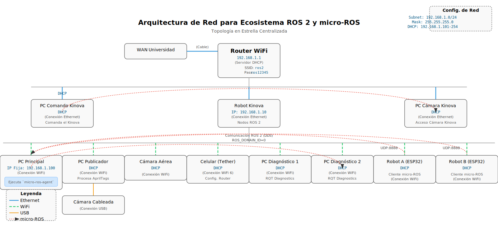

# ROS 2 Network Configuration

## Current Setup

Your ROS 2 installation is now configured for **network communication** between multiple PCs.

### Environment Variables

The following variables have been added to `~/.bashrc`:

```bash
export ROS_DOMAIN_ID=42
export ROS_AUTOMATIC_DISCOVERY_RANGE=SUBNET
export RMW_IMPLEMENTATION=rmw_cyclonedds_cpp
```

### What Each Variable Does

1. **`ROS_DOMAIN_ID=42`**
   - Creates a "network group" for your ROS nodes
   - Only nodes with the **same domain ID** can communicate
   - Range: 0-101 (use different IDs for different robot systems)

2. **`ROS_AUTOMATIC_DISCOVERY_RANGE=SUBNET`**
   - `SUBNET` = Discover any node reachable via multicast (default).
   - `LOCALHOST` = Only discover nodes on the same machine.
   - `OFF` = Do not discover any other nodes.
   - *Note: This replaces the deprecated `ROS_LOCALHOST_ONLY` variable.*

3. **`RMW_IMPLEMENTATION=rmw_cyclonedds_cpp`**
   - **Why use it?** CycloneDDS is significantly more stable in WiFi environments. It generates less "chatter" during node discovery and handles packet loss/latency (common in wireless) much better than the default Fast DDS.
   - **Installation:** It's not installed by default. Run:
     ```bash
     sudo apt update && sudo apt install ros-jazzy-rmw-cyclonedds-cpp
     ```
   - **Verification:** Run `printenv RMW_IMPLEMENTATION`. It should return `rmw_cyclonedds_cpp`.
   - **Alternative:** `rmw_fastrtps_cpp` (default). Use this only if you are using the *Discovery Server* (see below), otherwise, stay with CycloneDDS for mobile robots.

## Fast DDS Discovery Server (Advanced)

If you have issues with **multicast** (common in corporate or restricted WiFi), you can use the Discovery Server. This replaces the automatic "shouting" of nodes with a central "phonebook" (the Server).

### 1. The Configuration File (`fastdds_discovery.xml`)

This file configures your ROS nodes to act as **Super Clients**. Instead of searching the whole network, they connect directly to the IP of the Discovery Server.

*   **`<address>`**: Set to `192.168.1.100` (the PC Principal running the Agent/Server).
*   **`<port>`**: Default is `11811`.
*   **`<discoveryProtocol>`**: `SUPER_CLIENT` allows this node to see all other nodes, even if they aren't using the server (hybrid mode).

### 2. How to Use

**A. Start the Server (only on PC Principal):**
```bash
fastdds discovery --server-id 0 --ip-address 192.168.1.100 --port 11811
```

**B. Configure Clients (on all PCs):**
Add these variables to your `~/.bashrc`:
```bash
export RMW_IMPLEMENTATION=rmw_fastrtps_cpp
export FASTRTPS_DEFAULT_PROFILES_FILE=~/ros2_ws/src/burger_delivery/network_setup/fastdds_discovery.xml
```

*Note: You can also use the simpler `export ROS_DISCOVERY_SERVER="192.168.1.100:11811"` but the XML file gives more control over QoS and discovery behavior.*

## Network Information

- **WSL IP Address:** 172.27.119.126
- **Network:** Your local network (WiFi/Ethernet)

### Network Topology Diagram


## 💻 WSL Networking Configuration (Windows Users)

WSL2 uses a virtual network (NAT) by default, which can hide ROS nodes from the rest of the physical network.

#### Option A: Mirrored Mode (Recommended & Easiest) ⭐
This mode makes WSL share the same IP address as your Windows host (`192.168.1.100`), making all ROS nodes visible instantly.

1. Open Windows Explorer and go to `%USERPROFILE%` (e.g., `C:\Users\YourUser`).
2. Create or edit a file named `.wslconfig`.
3. Add the following lines:
   ```ini
   [wsl2]
   networkingMode=mirrored
   ```
4. Restart WSL from PowerShell:
   ```powershell
   wsl --shutdown
   ```
5. Verify in WSL: `ip addr` should now show your Windows IP.

#### Option B: Port Proxy (Alternative)
If you cannot use Mirrored mode, you must forward the DDS/micro-ROS ports from Windows to WSL.

Run in PowerShell as **Administrator**:
```powershell
# Forward micro-ROS Agent port
netsh interface portproxy add v4tov4 listenaddress=192.168.1.100 listenport=8888 connectaddress=<WSL_IP> connectport=8888
```
*(Note: You'll also need to forward DDS ports 7400-7500 for general ROS 2 discovery).*

## Configuring Other PCs

To connect another PC to this ROS 2 system:

### On Linux/Ubuntu PC:

1. Install ROS 2 Jazzy
2. Add to `~/.bashrc`:
   ```bash
   export ROS_DOMAIN_ID=42
   export ROS_AUTOMATIC_DISCOVERY_RANGE=SUBNET
   export RMW_IMPLEMENTATION=rmw_cyclonedds_cpp
   ```
3. Restart terminal or run: `source ~/.bashrc`

### On Windows PC (with ROS 2):

1. Set environment variables (PowerShell as Admin):
   ```powershell
   [System.Environment]::SetEnvironmentVariable('ROS_DOMAIN_ID', '42', 'User')
   [System.Environment]::SetEnvironmentVariable('ROS_AUTOMATIC_DISCOVERY_RANGE', 'SUBNET', 'User')
   [System.Environment]::SetEnvironmentVariable('RMW_IMPLEMENTATION', 'rmw_cyclonedds_cpp', 'User')
   ```
2. Restart terminal

## Testing Network Communication

### Test 1: Verify Configuration

You can use the automated scripts for a complete diagnostic:

**For ROS 2 & General Network:**
```bash
bash test_ros2_network.sh
```

**For WiFi Quality & Stability:**
```bash
# Linux
bash diagnostico_wifi.sh

# Windows (PowerShell)
.\diagnostico_wifi.ps1
```

**Network Diagnostics (All Levels):**
Check the unified guide: [`DIAGNOSTICO_RED.md`](DIAGNOSTICO_RED.md)

**What the scripts verify:**
1.  **WiFi Status:** Signal strength, channel congestion, and interface health.
2.  **Environment Variables:** Checks `ROS_DOMAIN_ID`, `ROS_AUTOMATIC_DISCOVERY_RANGE`, and `RMW_IMPLEMENTATION`.
3.  **Network Layer:** Extracts WSL IP, Gateway (Router) address, and DNS.
4.  **Core ROS 2:** Verifies the `ros2` CLI installation and version.
5.  **Discovery Scan:** Lists visible nodes and topics (confirms discovery is working).
6.  **DDS Ports:** Checks if UDP ports 7400-7500 are active.
7.  **Latency Test:** Measures ping response time to the router (critical for real-time control).

Or run manual checks:
# In WSL
source ~/.bashrc
echo $ROS_DOMAIN_ID  # Should show: 42
echo $ROS_AUTOMATIC_DISCOVERY_RANGE  # Should show: SUBNET
```

### Test 2: Publish from PC1, Subscribe from PC2

**PC1 (this WSL):**
```bash
source ~/ros2_ws/install/setup.bash
ros2 topic pub /test std_msgs/String "data: 'Hello from PC1'"
```

**PC2 (other computer):**
```bash
ros2 topic echo /test
# Should see: data: 'Hello from PC1'
```

### Test 3: See All Nodes on Network

```bash
ros2 node list  # Shows nodes from ALL PCs with domain ID 42
```

## Firewall Configuration

If nodes are not visible across PCs, check firewall:

### Windows Firewall (on Windows host):

```powershell
# Allow ROS 2 DDS ports (run as Admin)
New-NetFirewallRule -DisplayName "ROS2 Discovery (UDP)" -Direction Inbound -Action Allow -Protocol UDP -LocalPort 7400-7500
New-NetFirewallRule -DisplayName "ROS2 Discovery (UDP)" -Direction Outbound -Action Allow -Protocol UDP -LocalPort 7400-7500

# Allow Ping (ICMPv4) for network diagnostics
New-NetFirewallRule -DisplayName "Allow Ping (ICMPv4-In)" -Protocol ICMPv4 -IcmpType 8 -RemoteAddress Any -Action Allow
```

### Linux Firewall (on other PCs):

```bash
sudo ufw allow 7400:7500/udp
```

## Troubleshooting

### Nodes not visible across network?

1. **Check domain ID matches:**
   ```bash
   echo $ROS_DOMAIN_ID  # Must be same on all PCs
   ```

2. **Check discovery range setting:**
   ```bash
   echo $ROS_AUTOMATIC_DISCOVERY_RANGE  # Should be SUBNET (or unset defaults to SUBNET)
   ```

3. **Verify network connectivity:**
   ```bash
   ping <other-pc-ip>
   ```

4. **Check firewall** (see above)

5. **Restart ROS 2 Daemon:**
   If `ros2 topic list` hangs or doesn't show expected topics after a network change (like switching to Mirrored Mode), the daemon might be using outdated network information.
   ```bash
   # Force kill and restart
   pkill -f _ros2_daemon
   ros2 daemon start
   ```
   *Reason: The daemon caches network interfaces and IP addresses. If your IP changes (e.g., WSL switching to Mirrored Mode), the daemon can point to the old address, causing timeouts.*

6. **Restart ROS nodes** after changing environment variables

### Change Domain ID

To use a different domain (e.g., to isolate from other robots):

```bash
# Edit ~/.bashrc, change:
export ROS_DOMAIN_ID=99  # Use any number 0-101
```

Then restart terminal or `source ~/.bashrc`.

## Apply Changes

To apply the new configuration **immediately**:

```bash
source ~/.bashrc
```

Or close and reopen your terminal.

**Note:** Any ROS nodes already running will need to be restarted to use the new settings.
