# Mapa de Dependencias del Proyecto (Burger Delivery & Kinova)

Este diagrama ilustra cómo se relacionan los paquetes principales de tu workspace (`burger_delivery` y `ros2_kortex`) con las bibliotecas clave de ROS 2.

### Explicación de las Capas

1. **Tu Proyecto (`burger_delivery`):** Es el nivel más alto. Utiliza el URDF de Kinova (`kortex_description`) para visualizar todo en RViz y espera la conexión con los móviles a través de Micro-ROS.
2. **El "Cerebro" del Brazo (`kortex_moveit_config` & `MoveIt 2`):** Se encargan de planificar cómo mover el brazo del punto A al B sin chocar con nada.
3. **El "Motor" del Brazo (`kortex_driver` & `ros2_control`):** Reciben las instrucciones de MoveIt y las traducen a corrientes eléctricas a través de la API oficial de Kinova (`kortex_api`).
4. **Hardware Real:** El brazo recibe los comandos finales por cable de red, mientras que los ESP32 se comunican por WiFi al agente de Micro-ROS.
