# Mapa de Dependencias Cognitivas (Burger Delivery + Gemini ER)

Este diagrama demuestra cómo se incrusta la **Inteligencia Artificial Física** propuesta con `gemini-robotics-er-1.5-preview` dentro del ecosistema funcional actual de tu sistema basado en ROS 2.

### Nuevos Componentes (Color Púrpura):

1. **`v4l2_camera` (Nodo de Captura):** Toma control de la cámara física y publica las imágenes estandarizadas al tópico de ROS `/image_raw`.
2. **`burger_ai_brain_pkg` (El Orquestador):** Un nuevo script en Python que escucha la cámara y escucha tus órdenes por voz o texto. Este nodo empaqueta la foto + tu orden y se lo manda por REST API a Google.
3. **API Gemini ER:** Responde en milisegundos indicando qué hacer y exactamente en qué píxeles está la hamburguesa en la foto.

### ¿Cómo cambia el Flujo de la Aplicación (Color Azul)?

* En lugar de que tú programes coordenadas estáticas en `burger_delivery`, ahora es `burger_ai_brain_pkg` quien le envía comandos automáticos como accionar las bandejas.
* Al mismo tiempo `burger_ai_brain_pkg` envía las trayectorias de movimiento del brazo calculadas *al vuelo* directamente a `MoveIt 2`, haciendo que el brazo agarre la hamburguesa pase lo que pase, aunque la hayas cambiado de lugar en la mesa.
